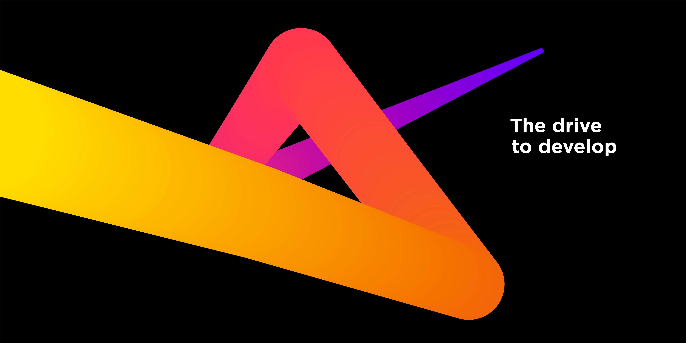

# three-go

 A list of threejs demo 
 
 Step by step learning threejs

## Content
- [clock](https://pengcu.github.io/three-go/src/pages/clock/index.html)
- [overwatch](https://pengcu.github.io/three-go/src/pages/overwatch/index.html)
- [point](https://pengcu.github.io/three-go/src/pages/pointmotion/index.html)
- [line](https://pengcu.github.io/three-go/src/pages/line/index.html)
- [cube](https://pengcu.github.io/three-go/src/pages/point/index.html)
- [noise](https://pengcu.github.io/three-go/src/pages/noise/index.html)
- [pixel](https://pengcu.github.io/three-go/src/pages/pixel/index.html)

I am very happy if this can help you.

## JetBrains

Thanks to JetBrains for providing IDE support for this project, click to buy JetBrains IDE license to support the strongest IDE in the universe.

